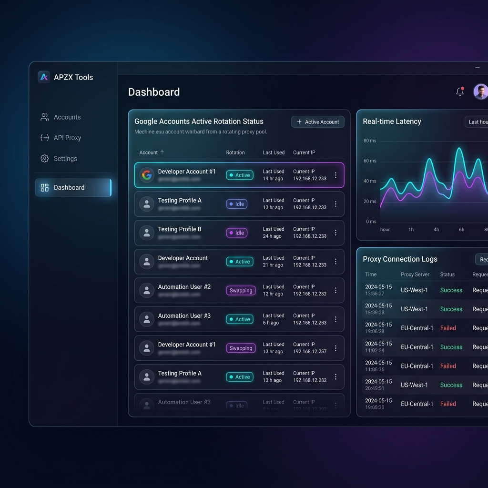
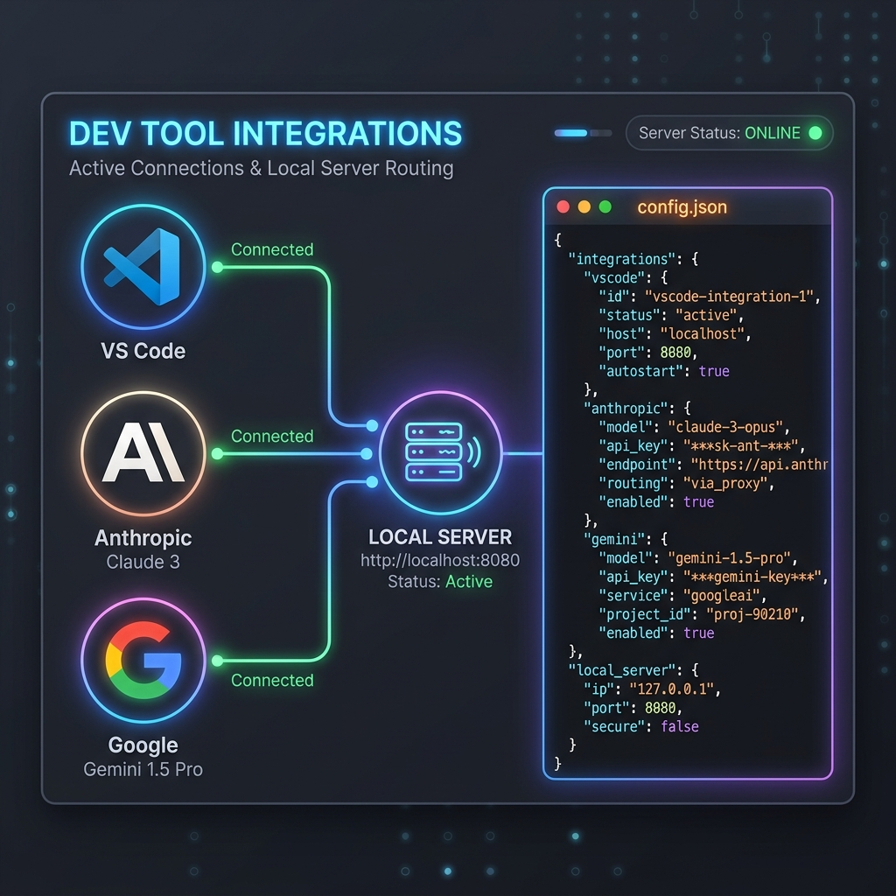
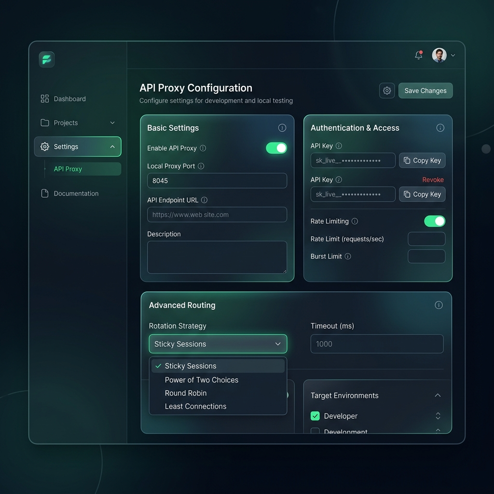

# APZX Tools - Enterprise Account & API Proxy Manager

APZX Tools is a premium, closed-source desktop helper utility designed to manage, rotate, proxy, and optimize Google accounts for high-throughput, seamless API developer operations with Gemini and Claude.

It serves as a localized middleman between your development environment (like VS Code, Cline, Continue, and CLIs) and the upstream APIs, handling token refreshing, rate-limiting retry strategies, and account rotation transparently.

<p align="center">
  
</p>

---

## 🚀 Key Features

* **100% English Localized UI:** Fully clean, English-based interface with all telemetries, updates, and tracking endpoints disabled for maximum security and privacy.
* **Intelligent Account Rotation:** Employs advanced rotation policies (P2C - Power of Two Choices, Sticky Sessions, and 60-second concurrency windows) to maximize rate limits and prevent socket timeouts.
* **Resilient 403 Forbidden Bypass:** Intercepts authorization and quota permission errors (e.g., *The caller does not have permission*). Instead of blocking accounts, it keeps them enabled and automatically falls back to the public Gemini Developer API.
* **Claude & OpenAI Compatibility:** Provides a local proxy server compatible with standard OpenAI and Claude endpoints. Translates requests on-the-fly and supports routing via custom or official Claude API Keys.
* **Developer Extension Helpers:** Offers one-click copyable configuration templates and step-by-step setup guides for popular coding tools like **Cline**, **Continue**, **Cody**, and **Claude Code CLI**.

---

## 📦 Getting Started

### 1. Installation
Download the latest pre-compiled installers from the release assets:
* **NSIS Setup EXE (Standard):** `APZX Tools_4.2.3_x64-setup.exe`
* **MSI Installer (Enterprise):** `APZX Tools_4.2.3_x64_en-US.msi`

### 2. Adding Google Accounts
1. Launch **APZX Tools**.
2. Go to the **Accounts** tab and click **Add Account**.
3. Choose **OAuth** (launches your default browser to safely authenticate and retrieve credentials) or import your existing database.

---

## 🔌 VS Code & Extension Integration

When running, APZX Tools exposes a local OpenAI-compatible endpoint (typically `http://localhost:8045/v1`) and an Anthropic-compatible endpoint (typically `http://localhost:8045`).

<p align="center">
  
</p>

### A. Cline Extension Setup
1. Open the **Cline** settings in VS Code.
2. Set **API Provider** to `OpenAI Compatible` or `Anthropic`.
3. Set **Base URL** to `http://localhost:8045/v1` (OpenAI Compatible) or `http://localhost:8045` (Anthropic).
4. Paste the proxy API Key generated at the top of the **API Proxy** tab.
5. Set the model ID (e.g., `gemini-2.5-pro` or `claude-3-7-sonnet`).

### B. Continue Extension Setup
Add the following configuration block to your `~/.continue/config.json`:

```json
{
  "models": [
    {
      "title": "APZX Gemini Proxy",
      "provider": "openai",
      "model": "gemini-2.5-pro",
      "apiBase": "http://localhost:8045/v1",
      "apiKey": "your-apzx-proxy-key"
    }
  ]
}
```

### C. Claude Code CLI Setup
Before running the `claude` CLI, run the following commands in your shell to redirect traffic to your APZX local server:

**Windows PowerShell:**
```powershell
$env:API_KEY="your-apzx-proxy-key"
$env:CLAUDE_BASE_URL="http://localhost:8045"
claude
```

**macOS / Linux Terminal:**
```bash
export API_KEY="your-apzx-proxy-key"
export CLAUDE_BASE_URL="http://localhost:8045"
claude
```

---

## 🛠️ Troubleshooting & 403 Forbidden Errors

<p align="center">
  
</p>

If a Google account displays a **403 Forbidden (The caller does not have permission)** error status:
* **Automatic Fix:** APZX Tools automatically bypasses this error by switching that account to **Public Developer API Mode**, allowing standard Gemini models to continue working.
* **Terminal Quick Fix:** If you want to enable full enterprise project features on that account, open your terminal and run:
  ```bash
  gcloud auth login --update-adc
  ```
  This updates your local Application Default Credentials (ADC) and authorizes the account for Google Cloud project-level resource access.
